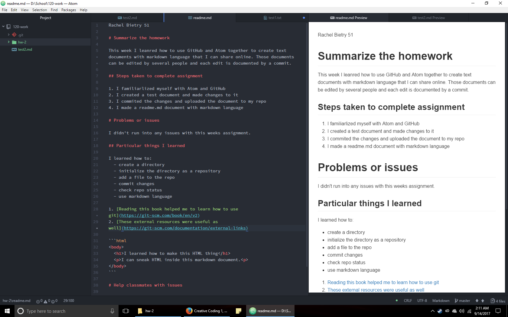

Rachel Bietry 51

# Summarize the homework

This week I leanred how to use GitHub and Atom together to create text documents with markdown language that I can share online. Those documents can be edited by several people and each edit is documented by a commit.

## Steps taken to complete assignment

1. I familiarlized myself with Atom and GitHub
2. I created a test document and made changes to it
3. I commited the changes and uploaded the document to my repo
4. I made a readme.md document with markdown language

# Problems or issues

I didn't run into any issues with this weeks assignment.

## Particular things I learned

I learned how to:
  - create a directory
  - initialize the directory as a repository
  - add a file to the repo
  - commit changes
  - check repo status
  - use markdown language

1. [Reading this book helped me to learn how to use git](https://git-scm.com/book/en/v2)
2. [These external resources were useful as well](https://git-scm.com/documentation/external-links)

```html
<body>
	<h1>I learned how to make this HTML thing</h1>
	<p>I can sneak HTML inside this markdown document.<p>
</body>
```

# Help classmates with issues

I couldn't find an issue that hadn't already been resolved, so I was unable to help my classmates with their issues.

## My editor


